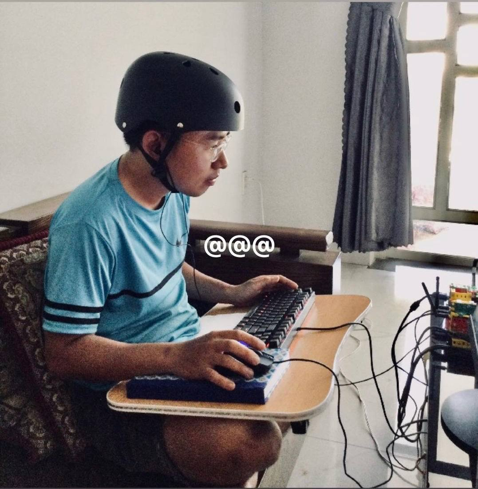

# Wingram Father

I'm just one person who wants to make something good for the world

---

## I had a strange dream
I found myself standing before an old, mysterious man.
He offered me a choice: a lot of money or an Book.
The Book was encrypted and he didn't tell me what was in it, he said I had to find out for myself.
I was very curious about what was hidden inside the Book, and I chose the Book.

## How I help you?
- I don't go to school to teach students knowledge
- I don't go to church to teach people right and wrong
- I go out on the street to help a random person change their mind

## I quit anything
- I give up trivial pleasures to gain knowledge
- I dropped out of university when I realized they weren't teaching me real knowledge 
- I left my own company when I realized money is not my purpose (and capitalism) 
- I stopped building Non-Free software when I realize [how bad of it](https://www.gnu.org/philosophy/who-does-that-server-really-serve)

## What i do today? 
I find the Truth